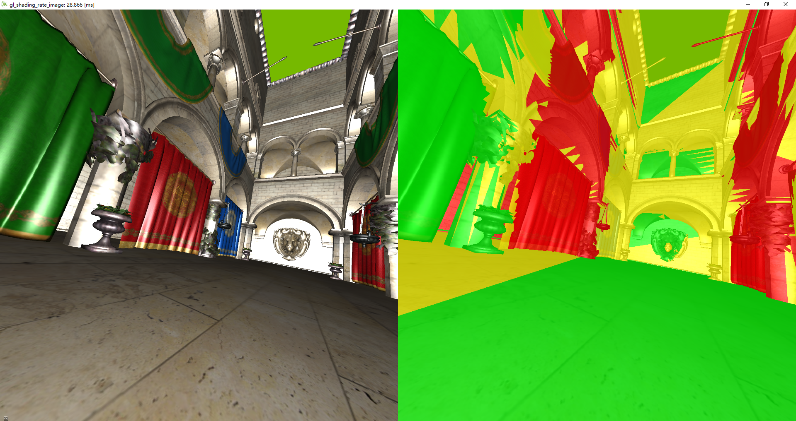

# Depth-based Foveated Rendering

基于深度的foveated-rendering

本研项目，仍在开发中

效果展示：

不同颜色代表不同渲染的分辨率。(红黄蓝分别代表1x1,2x2,4x4)

目前在VR上实现。

***

实验室的运行环境是：

+ CPU: Intel(R) Core(TM) i7-8700 CPU @ 3.20GHz
+ 内存: 32GB
+ GPU: nvidia 2080
+ VR头盔: HTC Valve

***

项目代码在`gl_shading_rate_image/`中，解决方案文件为`gl_shading_rate_image/depth-based_foveated_rendering.sln`.

依赖库有：

+ `AntTweakBar` 用于在运行时提供调整参数的菜单栏
+ `nv_math` 英伟达的数学库
+ `gl,glew` 等基础gl库
+ `glm` opengl数学库
+ `assimp`模型加载库.据说对平台兼容性不好，在不同平台/硬件上可能需要专门另行build.
+ `stb_image` 图像加载库
+ `openvr` VR接口

此外，此项目依赖英伟达的variable shading rate扩展运行。

不幸的是，我没能解决VS项目的所有路径依赖问题，程序可能运行不起来。如果需要运行程序，请与我联系，我会提供完整的代码。

***

在`MainApplication.h`中，可以通过控制宏定义控制一些选项

+ `#define __VR_PART` 是否运行在vr上。建议不要改动，该版本没有测试vr关闭时的功能
+ `#define __HTTP_PART` 是否与DGaze眼动预测模型连接，仍在开发中。
+ `#define __RENDER_TORUS` 若定义，渲染锁链场景（锁链数量可变）。否则，渲染从文件中加载的模型。——场景为锁链时菜单中的MN等选项才是有效的。

